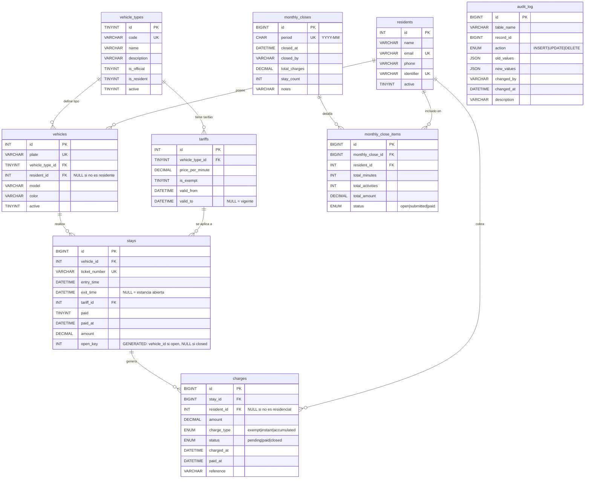

# Modelo de Datos — Estacionamiento Neology

## Descripción general

El modelo relacional soporta un sistema de control de acceso vehicular para estacionamientos, con énfasis en:
- **Integridad referencial:** llaves primarias y foráneas en todas las relaciones.
- **Restricciones de negocio:** CHECK constraints, UNIQUE constraints y un generador de columna que previene múltiples estancias abiertas por vehículo.
- **Trazabilidad:** tabla `audit_log` con triggers automáticos en las operaciones críticas.
- **Historicidad:** tarifas con vigencia temporal, cierres mensuales inmutables como materialización de estados.
- **Extensibilidad:** catálogo de tipos de vehículo que permite agregar nuevos sin cambios en el esquema.

---

## Diagrama Entidad-Relación (Mermaid)

---

## Descripción de entidades

### vehicle_types (Catálogo de tipos de vehículo)

| Campo | Tipo | Restricciones | Descripción |
|---|---|---|---|
| `id` | TINYINT UNSIGNED | PK, AUTO_INCREMENT | Identificador del tipo |
| `code` | VARCHAR(20) | UNIQUE, NOT NULL | Código del tipo (OFICIAL, RESIDENTE, GENERAL) |
| `name` | VARCHAR(50) | NOT NULL | Nombre descriptivo |
| `description` | VARCHAR(255) | NULL | Descripción detallada |
| `is_official` | TINYINT(1) | NOT NULL, DEFAULT 0 | 1 = vehículo exento de pago |
| `is_resident` | TINYINT(1) | NOT NULL, DEFAULT 0 | 1 = aplica tarifa residencial acumulada |
| `active` | TINYINT(1) | NOT NULL, DEFAULT 1 | 1 = tipo habilitado |

**Regla de negocio:** `is_official=1` implica `is_resident=0` y `is_resident=1` implica `is_official=0`. Esto no se fuerza con CHECK (por flexibilidad futura) pero se documenta y se espera en los datos.

---

### residents (Residentes)

| Campo | Tipo | Restricciones | Descripción |
|---|---|---|---|
| `id` | INT UNSIGNED | PK, AUTO_INCREMENT | Identificador del residente |
| `name` | VARCHAR(120) | NOT NULL | Nombre completo |
| `email` | VARCHAR(120) | UNIQUE | Correo electrónico (puede ser NULL) |
| `phone` | VARCHAR(30) | NULL | Teléfono |
| `identifier` | VARCHAR(30) | UNIQUE | Número de credencial o tarjeta |
| `active` | TINYINT(1) | NOT NULL, DEFAULT 1 | 1 = residente activo |

---

### vehicles (Vehículos)

| Campo | Tipo | Restricciones | Descripción |
|---|---|---|---|
| `id` | INT UNSIGNED | PK, AUTO_INCREMENT | Identificador del vehículo |
| `plate` | VARCHAR(20) | UNIQUE, NOT NULL | Placa del vehículo |
| `vehicle_type_id` | TINYINT UNSIGNED | FK → vehicle_types, NOT NULL | Tipo del vehículo |
| `resident_id` | INT UNSIGNED | FK → residents, NULL | Solo para residentes; NULL para no residentes |
| `model` | VARCHAR(50) | NULL | Modelo del vehículo |
| `color` | VARCHAR(30) | NULL | Color |
| `active` | TINYINT(1) | NOT NULL, DEFAULT 1 | 1 = vehículo habilitado |

**Relación con residentes:** un vehículo puede no estar asociado a residente (visitante). Si `resident_id IS NULL`, se asume que es un vehículo general.

---

### tariffs (Tarifas)

| Campo | Tipo | Restricciones | Descripción |
|---|---|---|---|
| `id` | INT UNSIGNED | PK, AUTO_INCREMENT | Identificador de la tarifa |
| `vehicle_type_id` | TINYINT UNSIGNED | FK → vehicle_types, NOT NULL | Tipo al que aplica |
| `price_per_minute` | DECIMAL(10,4) | NOT NULL, CHECK ≥ 0 | Precio por minuto |
| `is_exempt` | TINYINT(1) | NOT NULL, DEFAULT 0 | 1 = exento de cobro |
| `valid_from` | DATETIME | NOT NULL | Fecha/hora de inicio de vigencia |
| `valid_to` | DATETIME | NULL | NULL = vigente indefinidamente |

**Histórico de tarifas:** cada cambio de tarifa se registra como una nueva fila con `valid_from` y `valid_to`. Las estancias antiguas conservan el `tariff_id` aplicado, permitiendo reproducir cálculos históricos de forma exacta.

---

### stays (Estancias)

| Campo | Tipo | Restricciones | Descripción |
|---|---|---|---|
| `id` | BIGINT UNSIGNED | PK, AUTO_INCREMENT | Identificador de la estancia |
| `vehicle_id` | INT UNSIGNED | FK → vehicles, NOT NULL | Vehículo que realiza la estancia |
| `ticket_number` | VARCHAR(30) | UNIQUE, NOT NULL | Folio impreso del boleto |
| `entry_time` | DATETIME | NOT NULL | Momento de entrada |
| `exit_time` | DATETIME | NULL | NULL = estancia abierta |
| `tariff_id` | INT UNSIGNED | FK → tariffs, NOT NULL | Tarifa aplicada al momento de entrada |
| `paid` | TINYINT(1) | NOT NULL, DEFAULT 0 | 1 = pagado |
| `paid_at` | DATETIME | NULL | Momento del pago |
| `amount` | DECIMAL(12,2) | NULL, CHECK ≥ 0 | Importe final |
| `open_key` | INT UNSIGNED | UNIQUE (generated) | `vehicle_id` si `exit_time IS NULL`, NULL si cerrada |

**Regla de negocio reforzada (open_key):** el índice `UNIQUE (open_key)` garantiza que un vehículo solo puede tener una estancia abierta a la vez, ya que solo una fila puede tener `vehicle_id` distinto de NULL en ese índice (los NULL se ignoran en UNIQUE).

---

### charges (Cargos y Pagos)

| Campo | Tipo | Restricciones | Descripción |
|---|---|---|---|
| `id` | BIGINT UNSIGNED | PK, AUTO_INCREMENT | Identificador del cargo |
| `stay_id` | BIGINT UNSIGNED | FK → stays, NOT NULL | Estancia asociada |
| `resident_id` | INT UNSIGNED | FK → residents, NULL | Solo para residentes acumulados |
| `amount` | DECIMAL(12,2) | NOT NULL, CHECK ≥ 0 | Monto del cargo |
| `charge_type` | ENUM | NOT NULL | `exempt`=oficial, `instant`=no residente, `accumulated`=residente |
| `status` | ENUM | NOT NULL | `pending`, `paid`, `closed` |
| `charged_at` | DATETIME | NOT NULL | Momento en que se registró el cargo |
| `paid_at` | DATETIME | NULL | Momento del pago |
| `reference` | VARCHAR(40) | NULL | Referencia de pago (tarjeta, efectivo, etc.) |

---

### monthly_closes (Cierres mensuales — cabecera)

| Campo | Tipo | Restricciones | Descripción |
|---|---|---|---|
| `id` | BIGINT UNSIGNED | PK, AUTO_INCREMENT | Identificador del cierre |
| `period` | CHAR(7) | UNIQUE, NOT NULL | Periodo en formato YYYY-MM |
| `closed_at` | DATETIME | NOT NULL | Fecha/hora del cierre |
| `closed_by` | VARCHAR(64) | NOT NULL | Usuario que ejecutó el cierre |
| `total_charges` | DECIMAL(14,2) | NOT NULL | Total cobrado en el periodo |
| `stay_count` | INT UNSIGNED | NOT NULL | Número de estancias consideradas |
| `notes` | VARCHAR(255) | NULL | Observaciones |

**Constraint de unicidad:** `UNIQUE (period)` previene ejecuciones duplicadas del cierre mensual (verificado en el procedimiento `execute_monthly_close`).

---

### monthly_close_items (Detalle por residente en el cierre)

| Campo | Tipo | Restricciones | Descripción |
|---|---|---|---|
| `id` | BIGINT UNSIGNED | PK, AUTO_INCREMENT | Identificador del item |
| `monthly_close_id` | BIGINT UNSIGNED | FK → monthly_closes, NOT NULL | Cabecera del cierre |
| `resident_id` | INT UNSIGNED | FK → residents, NOT NULL | Residente |
| `total_minutes` | INT UNSIGNED | NOT NULL | Minutos acumulados en el periodo |
| `total_activities` | INT UNSIGNED | NOT NULL | Número de estancias |
| `total_amount` | DECIMAL(14,2) | NOT NULL | Importe acumulado |
| `status` | ENUM | NOT NULL | `open`, `submitted`, `paid` |

**Constraint de unicidad:** `UNIQUE (monthly_close_id, resident_id)` — cada residente aparece una sola vez por cierre.

---

### audit_log (Auditoría)

| Campo | Tipo | Restricciones | Descripción |
|---|---|---|---|
| `id` | BIGINT UNSIGNED | PK, AUTO_INCREMENT | Identificador del evento |
| `table_name` | VARCHAR(64) | NOT NULL | Tabla modificada |
| `record_id` | BIGINT UNSIGNED | NULL | ID del registro modificado |
| `action` | ENUM | NOT NULL | INSERT, UPDATE, DELETE |
| `old_values` | JSON | NULL | Estado previo (UPDATE/DELETE) |
| `new_values` | JSON | NULL | Estado posterior (INSERT/UPDATE) |
| `changed_by` | VARCHAR(64) | NOT NULL | Usuario que realizó el cambio |
| `changed_at` | DATETIME | NOT NULL | Fecha/hora del cambio |
| `description` | VARCHAR(255) | NULL | Descripción legible |

**Triggers:** `stays` tiene triggers automáticos de auditoría en INSERT y UPDATE (ver schema.sql).

---

## Índices propuestos (resumen)

| Tabla | Índice | Propósito |
|---|---|---|
| stays | `idx_stays_open_by_vehicle` (exit_time, vehicle_id) | Consulta Q1: vehículos dentro |
| stays | `idx_stays_entry_future` (entry_time) | Consulta Q7: detección de fechas futuras |
| stays | `idx_stays_paid_incomplete` (paid, paid_at, amount) | Consulta Q7: datos incompletos |
| stays | `idx_stays_period_accrual` (entry_time, vehicle_id, exit_time) | Consultas Q3b, Q8: acumulación mensual |
| stays | `idx_stays_resident_period` (vehicle_id, entry_time, exit_time) | Consulta Q3b: reporte por residente |
| charges | `idx_charges_status_date_amount` (status, charge_type, charged_at, amount) | Consulta Q4: ingresos por día y tipo |

---

## Justificación de decisiones de diseño

| Decisión | Justificación |
|---|---|
| `open_key` GENERATED + UNIQUE | Fuerza la regla "una sola estancia abierta por vehículo" directamente en la BD, sin depender de la aplicación. Es más confiable que un trigger. |
| `amount` en `stays` y en `charges` | `stays.amount` se calcula al cierre de la estancia y es inmutable después. `charges.amount` registra el monto acumulado mensual para residentes. |
| `tariff_id` en `stays` | La tarifa se registra al momento de la entrada para poder reproducir cálculos históricos incluso si la tarifa cambia después. |
| `monthly_closes` UNIQUE en `period` | Previene ejecuciones duplicadas del cierre sin necesidad de transacciones distribuidas. |
| `audit_log` como tabla JSON | La estructura de old_values/new_values como JSON permite almacenar cambios de cualquier tabla sin necesidad de columnas específicas por tabla. |
| Sin DELETE en datos de negocio | Las estancias, cargos y cierres nunca se eliminan; el `exit_time NULL` codifica el estado. Esto garantiza la trazabilidad histórica completa. |